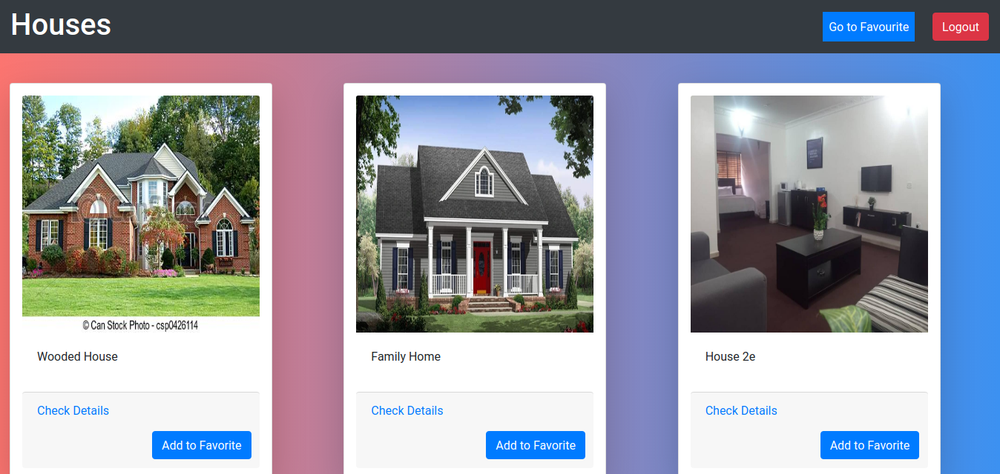
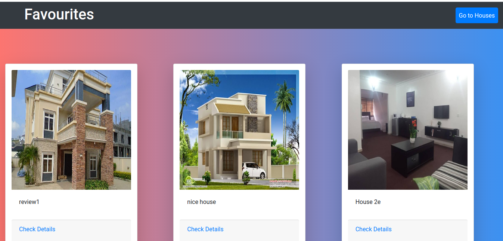
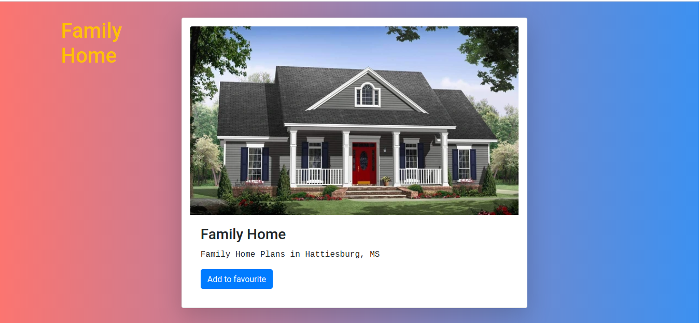

# Find Your House

An App where you can view and add favourite houses to a list.

## Live demo

[live demo](https://find-your-house-now.netlify.app)

## ScreenShot

- Houses List

- Favorites

- House detail

## Built With

 - ReactJs
 -	React Hooks
 -	Netlify (For deployment)
 -	Jest
 -	CSS (Modules)
 -	Bootstrap
 -	HTML
 -	Webpack
 -	ES6 JavaScript.

## Getting Started 

- To get a local copy up and running follow these simple example steps.

## Prerequisites

 - Node
 - Javascript
 - React
 - Redux
 - npm
 - Editor of your choice
		

## Setup

- Clone the repository.
-	Run npm install to install dependencies.
-	Run npm start to start the development server.
-	Your browser should open. Click on the dist folder to see the app.

# About this project

 - This Application is built as a front end app consuming a Ruby on Rails API separately     deployed to Heroku.

# End Points

	POST

		/signup - (Creates user account)
		/login - (Log user in)

	GET
		/	- (Homepage)
		/dashboard - (List houses)
		/dashboard/:id/:name - (Get house details)
		/favourite - (List favorite houses)

## Authors

👤 **Ignatius Sani**

- Github: [ignatius22](https://github.com/ignatius22)
- Twitter: [@Iggy_code](https://twitter.com/iggy_code)
- Linkedin: [linkedin](https://www.linkedin.com/in/ignatiussani)

## 🤝 Contributing

Contributions, issues and feature requests are welcome!

Feel free to check the <a href="https://github.com/ignatius22/Find-A-House/issues" target="_blank">issues page</a>.

## Show your support

Give a ⭐️ if you like this project!

## Acknowledgments
 
- <a href="https://www.microverse.org/" target="_blank">Microverse</a>