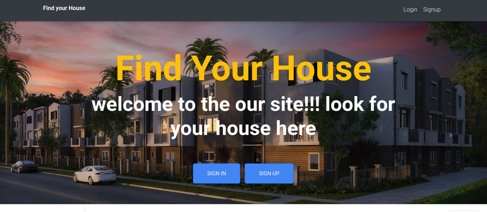
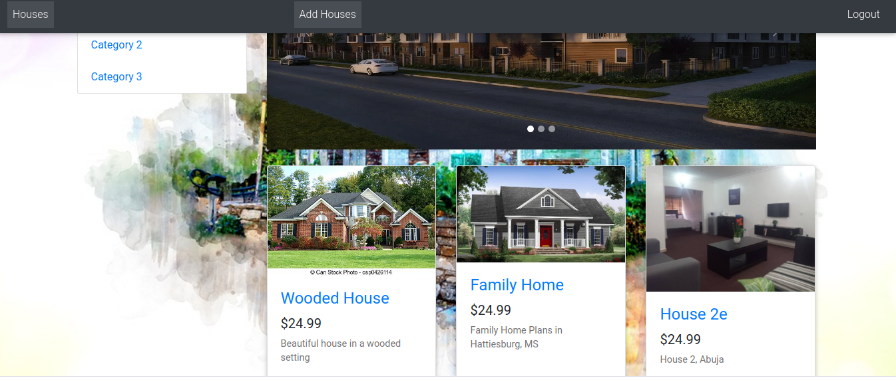
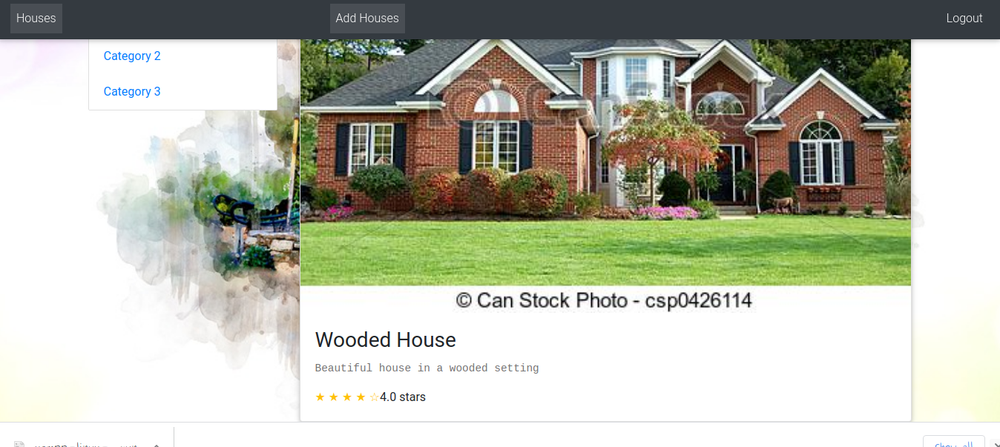

# Find Your House

An App where you can view and add favourite houses to a list.

## Live demo

[live demo](https://munch-it-pro.netlify.app/1)

## ScreenShot

- Homepage

- Houses List

- House Detail

## Built With

- React
- Redux
- Jest
- Bootstrap

## Getting Started 

- To get a local copy up and running follow these simple example steps.

## Prerequisites

 - Node
 - Javascript
 - React
 - Redux
 - npm
 - Editor of your choice
		

## Setup

- Clone the repository.
-	Run npm install to install dependencies.
-	Run npm start to start the development server.
-	Your browser should open. Click on the dist folder to see the app.

## Authors

👤 **Ignatius Sani**

- Github: [ignatius22](https://github.com/ignatius22)
- Twitter: [@Iggy_code](https://twitter.com/iggy_code)
- Linkedin: [linkedin](https://www.linkedin.com/in/ignatiussani)

## 🤝 Contributing

Contributions, issues and feature requests are welcome!

Feel free to check the <a href="https://github.com/ignatius22/redux-capstone/issues" target="_blank">issues page</a>.

## Show your support

Give a ⭐️ if you like this project!

## Acknowledgments
 
- <a href="https://www.microverse.org/" target="_blank">Microverse</a>